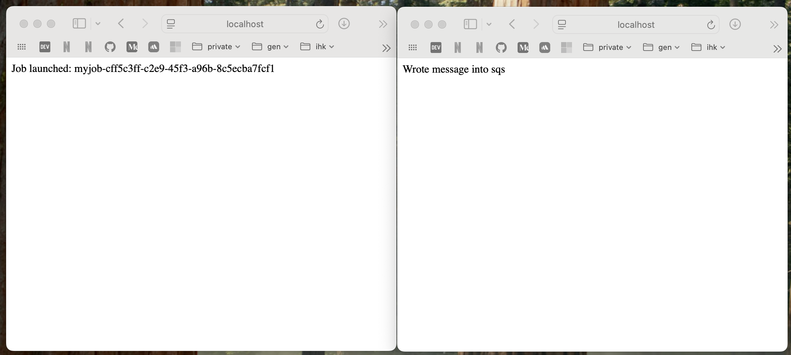
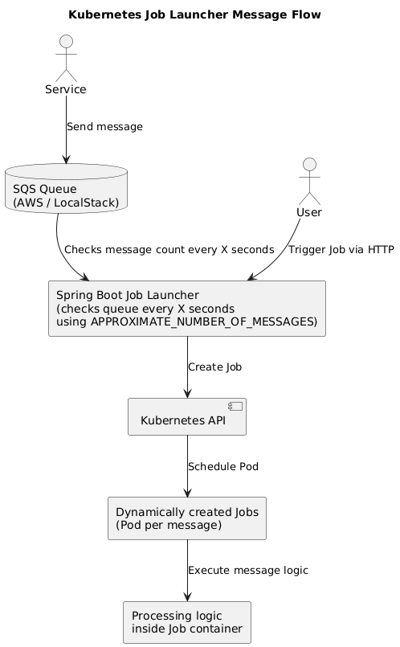
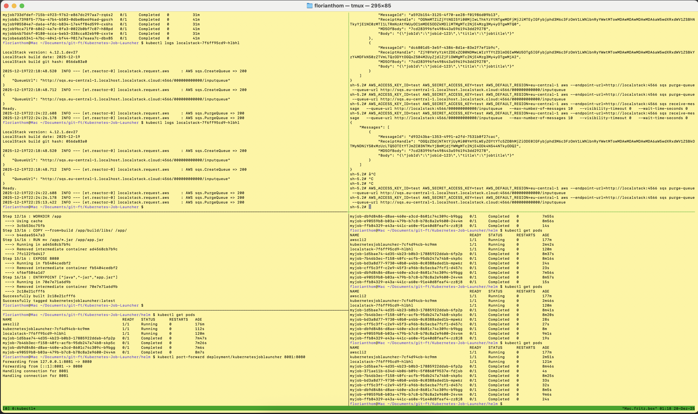

# Kubernetes-Job-Launcher
A Spring Boot app demonstrating how to launch and manage Kubernetes Jobs programmatically based on http requests and sqs messages.
Jobs are launched by using target-job-template from k8s-configmap either created by helm definition from this or external app.

<p align="center" width="100%">

</p>


## Features

* Launches a Kubernetes Job per http request or AWS SQS message using the official Kubernetes Java client
* Supports dynamic environment variables for Jobs
* Job templates can be stored in a ConfigMap for easy updates without redeploying the app

## Requirements

* Java 25+
* Gradle 9.2+
* macOS, Linux, or Windows
* Docker (compose) v2
* Kubernetes cluster (EKS, minikube, colima, etc.)
* (Optional) LocalStack for local development

## Architecture

The architecture of this approach is displayed by following overview.

<p align="center" width="100%">

</p>

## Run app locally

1. Make sure to connect to the correct cluster in the correct context

```
$ kubectl config current-context
```

2. Create configmap in cluster

```
$ kubectl create configmap job-template-cm --from-file=job-template.yaml=helm/files/job-template.yaml
```

3. Start localstack with docker compose and the application

```
$ docker compose up -d
$ ./gradlew bootRun
```

## Run app in cluster

1. Adjust properties in src/main/java/resources/application.yaml
2. Create docker image and run it

```
$ docker build -t kubernetesjoblauncher:latest .
$ docker run -p 8081:8080 kubernetesjoblauncher:latest -d
```

3. Create and install helm package

```
$ helm package ./
$ helm upgrade --install kubernetesjoblauncher ./kubernetesjoblauncher-0.1.0.tgz
```

4. Forward ports to the cluster

```
$ kubectl port-forward deployment/kubernetesjoblauncher 8081:8080
```

## Important commands
A selection of useful commands will be presented

* Test und Debug via AWS-Cli

```
$ kubectl run -d -it awscli --image=amazon/aws-cli --restart=Never --command -- sleep infinity
$ kubectl exec -it awscli -- sh
```

* Purge AWS SQS queue

```
# purge from host
$ AWS_ACCESS_KEY_ID="test" \
AWS_SECRET_ACCESS_KEY="test" \
AWS_DEFAULT_REGION="eu-central-1" \
aws --endpoint-url=http://localhost:4566 sqs purge-queue \
--queue-url http://sqs.eu-central-1.localhost.localstack.cloud:4566/000000000000/inputqueue

# purge from within cluster as long as localstack is deployed
$ AWS_ACCESS_KEY_ID=test \
AWS_SECRET_ACCESS_KEY=test \
AWS_DEFAULT_REGION=eu-central-1 \
aws --endpoint-url=http://localstack:4566 sqs purge-queue \
--queue-url http://sqs.eu-central-1.localhost.localstack.cloud:4566/000000000000/inputqueue
```

* Delete completed jobs

```
$ kubectl delete jobs --field-selector status.successful=1
```

* List all messages in queue

```
$ AWS_ACCESS_KEY_ID=test \
AWS_SECRET_ACCESS_KEY=test \
AWS_DEFAULT_REGION=eu-central-1 \
aws --endpoint-url=http://localstack:4566 sqs receive-message \
--queue-url http://localstack:4566/000000000000/inputqueue \
--max-number-of-messages 10 \
--visibility-timeout 0 \
--wait-time-seconds 0
```

<p align="center" width="100%">

</p>


## Additonal hints

* To run new docker image inside cluster just delete the running pod - because of "pullPolicy: Never" (helm values.yaml) the newest image from local registry will be used
* Use labels → Track multiple Job runs cleanly
* Make kubernetes not retry the pod itself (if going via AWS SQS) set `backofflimit: 0` and `restartPolicy: Never` in job-template.yaml
* Current AWS SQS auth uses `accessKey` and `secretKey` - for prod this should be replaced by AWS IAM policies
* Worker-Apps could use this launcher-app by integrated it via a helm-sub-chart (dependency)
  * Regarding AWS IAM policies this leads to incorporate the launcher-app service-account into the AWS SQS config